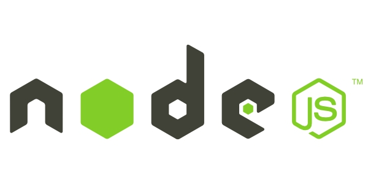
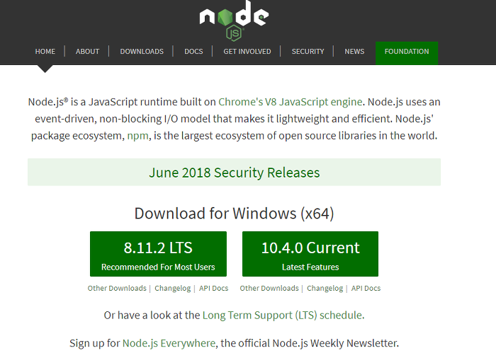
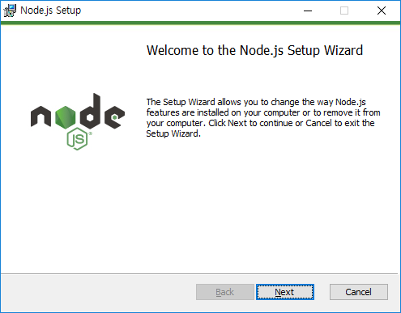

## Node.Js란?

 
Node.js는 이벤트 기반, 논블로킹 I/O 모델을 사용하는 가볍고 효율적인 자바스크립트 서버 엔진이다. 
 

## Node.js 설치, Vs Code에서 개발 환경

### Node.Js 설치(Window)
[Node.js 다운로드 링크](https://nodejs.org/en/)

링크에 접속하면 위와 같은 화면이 나온다.
 여기서 우측의 Current는 최신 버전인데 최신버전은 안정화가 안되어있을 수 있으니 학습용으로 할때는 좌측의 LTS버전으로 다운받는다. 
 
다운이 완료되면 아래와 같은 화면이 나오는데 늘 그래왔듯이 설치할 디렉토리를 정하는곳을 제외하고 전부 Next를 눌러주자 

 
 
전부 완료되었다면 cmd화면에서 node -v를 실행 시키면 정상적으로 설치가된것을 확인 할 수 있다. 

### Vs Code 개발 환겅

[Vs Code설치하는 방법 링크](https://webnautes.tistory.com/1197)

 
설치가 완료 되었으면 vsCode 좌측에 저 아이콘을 눌러주자  

 
 
 그런다음 EXTENSIONS에서 아래의 순서대로 검색후 설치를 해주자
* vs code모듈에서 standard검색 후 StandardJS설치
* vs code모듈에서 react검색 후 React Native Tools 설치
* vs code모듈에서 react검색 후 ES7 React/Redux... 설치
 

그다음  vs code 터미널에서 node -v, npm -v로 설지 확인 
