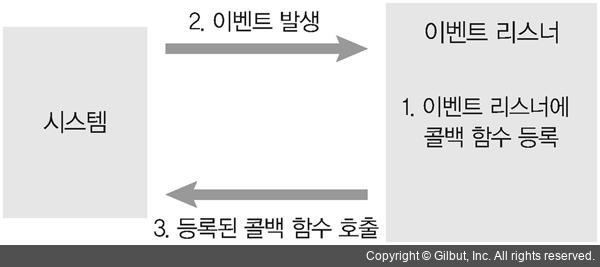

## Node.Js 핵심 개념

## 이벤트 기반

<br>
Node는 이벤트 기반이다. 여기서 이벤트 기반이라는 것은 사용자의 입력같은 이벤트가 발생 했을때 이런 이벤트를 처리하는 것을 미리 정해두어야 하는 것을 의미한다.
<br>즉, 이벤트 리스너(event listener)에 콜백(call back) 함수를 등록하는 것이다.<br>
그리고 이벤트가 없으면 Node는 이벤트가 발생하기를 대기한다.<br>

<br>
이벤트 기반에는 이벤트 루프(event loop)라는 것이 존재하는데 이벤트 루프는 실행될 함수들을 관리한다.<br>
이벤트 루프를 구성하는 것은 3가지가 있는데

1. 콜 스택
2. 콜백 큐
3. Web api
<br>
<br>

우선 첫번째 콜스택은 실행될 함수를 스택에 저장한다.
콜스택에 있는 함수는 현시점에서 실행될 함수이다.<br>
그다음 콜백 큐는 함수가 대기하는 공간이다. 이러면 큐도 함수를 저장하고 스택도 저장하는 것 처럼 보이는데 정확히 구분하면 스택은 지금 당장 실행될 대상이고 큐는 특정 조건에 의해 실행대기를 하는 곳이다. 특정 조건이라 하면 요청에의해 30초뒤에 응답이 필요한 경우 같은 것을 의미한다.<br>
그다음 Web api는 사용자의 요청이 들어 왔을때 실행될 코드가 대기하는 공간이다<br>


<br>
```javascript
function run(){
    console.log('함수 실행')
}
function run2(){
    console.log('함수2 실행')
}
function runTime(){
    setTimeout(run,3000)
}
run()
runTime()
run2()
```


위의 코드를 보면 함수 3개가 존재하는데 runTime함수는 setTimeout으로 3초뒤에 실행되게 했다. 그리고 호출 순서는 
run -> runTime -> run2 이다. 

<br>
그러면 먼저 run 함수가 콜 스택에 들어가고 실행된다. 그다음 runTime 함수도 들어가는데 여기서 runTime함수는 다시 run함수를 호출하는데 3초뒤에 run함수를 실행시킨다. 이때 runTime함수가 실행 시킨 run함수는 콜백 큐에 들어간다. 그다음 run2함수는 콜 스택에 들어가서 실행 되고 마지막으로 콜백 큐에 있던 run함수가 콜 스택으로 가서 실행 된다.<br>


<br>
<br>

## Non Blocking
논 블로킹이란 I/O의 처리를 위해 사용되는 방식 입니다<br>
사용자의 요청이 들어오면 그 요청을 처리하는 시간동안 사용자가 다른 것을 못한다면 그건 매우 비효율적 입니다.<br>
그리고 서버의 입장에서는 사용자 요청을 처리하는 동안 다른 작업을 못처리 하고 있으면 많은 작업들이 쌓이게 될 수 도 있습니다<br>
이건 바로 코드롤 봅시다.<br>
```javascript
function bigfunc(){
    console.log('오래 걸리는 작업 끝')
}
console.log('시작')
bigfunc()
console.log('끝')
```
<br>
이렇게하면 실행 결과는 시작 -> 오래 걸리는 작업 끝 ->  끝 이렇게 나올 것 입니다. 이렇게 되면 오래 걸리는 작업을 하는 동안 다음 작업을 하짐 못합니다. 이런 방식을 블록킹(Blocking)이라고 합니다<br>
<br>

```javascript
function bigfunc(){
    console.log('오래 걸리는 작업 끝')
}
console.log('시작')
setTimeout(bigfunc,1000)
console.log('끝')
```
<br>
위의 코드는 Non Blocking방식 입니다.<br> setTimeout으로 오래 걸리는 작업을 1초 뒤에 실행하게 하여 다음 작업을 처리 했습니다.<br>


